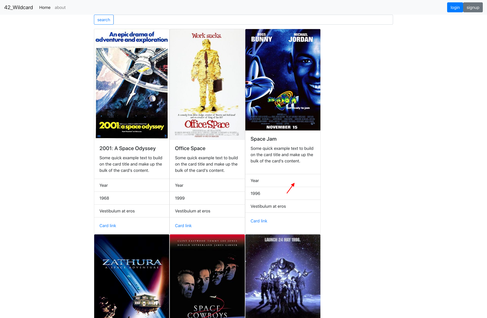

# 42_Wildcard



## Getting Started
to install locally run this command in your terminal
```
git clone https://github.com/LucasTaboada/42_wildcard.git
```
run this once inside of the base folder and once inside of the client folder 
```
npm install
```
then once again inside the client folder.

Now we need to make a dev.js file inside of the config folder and fill in these keys
```
module.exports = {
    SECRET_KEY:'fhsdfhsdfsdfhsfdsdfhsdjkpwejgvmky;dwedsg', // create any key
    MONGO_URL:'mongodb://localhost/methodize'
  };
```
The last step is to make sure your mongo sever is running and and type this command in your termial
```
npm run dev
```

### Prerequisites

* [Nodejs](https://nodejs.org/)
* [MongoDB](https://www.mongodb.com/)


## Built With

* [React](https://reactjs.org/) - The web framework used 
* [Redux](https://redux.js.org/) - State manager
* [Redux-Thunk](https://github.com/gaearon/redux-thunk) - redux middleware
* [Axios](https://github.com/axios/axios) - Promise based HTTP client 
* [React-Router](https://reacttraining.com/react-router/) - client side routing
* [Expressjs](https://expressjs.com/) - nodejs server side framework
* [Mongoose](http://mongoosejs.com/) - an object data modeling (ODM) library for MongoDB
* [JWT](https://github.com/auth0/node-jsonwebtoken) - session storage and authentication


## License

This project is licensed under the MIT License - see the [LICENSE.md](LICENSE.md) file for details